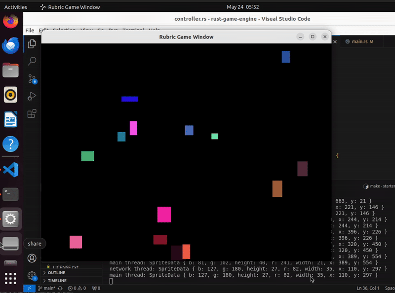

# Building a Game Engine with Rust from the Ground Up

This repository serves as the starting point for building a simple yet functional game engine using Rust. The project is designed to help you apply the concepts and skills you've learned throughout the Rust course. By completing this project, you'll gain hands-on experience with Rust's advanced features, including multi-threading, macros, and interoperability with C code.

## Getting Started

When working on this project, you can choose between utilizing Udacity's VM environment or setting it all up on your local machine. If you prefer to use the Udacity VM, you can skip the local environment prerequisite steps and jump straight to the project instructions.

### Local environment prerequisites

While this project has no specific dependencies on any system, it was built on a Unix-based machine. So, if you're on Windows, I'd recommend using the Windows Subsystem for Linux (WSL), so all instructions here directly apply to your system.  

For this project, you'll need to have Rust installed in your machine. If you haven't installed Rust yet, you can do so with:

```bash
curl --proto '=https' --tlsv1.2 -sSf https://sh.rustup.rs | sh
```

Also, because we are dealing with C code in this project, you'll need to have a C compiler installed on your machine. You can install the `build-essential` package, which includes the GNU C Compiler (GCC) and other necessary tools:

```bash
sudo apt update
sudo apt install build-essential
```

Finally, you'll need to have GLFW installed in your machine. GLFW is a C library that will be the foundation of our game engine. You can install it with:

```bash
sudo apt install libglfw3 libglfw3-dev
```

### Running the Test C Game

To start with your project, clone this repository to your local machine:

```bash
git clone https://github.com/udacity/intro-to-rust-starter.git
# or, git clone git@github.com:udacity/intro-to-rust-starter.git
```

To ensure you are set up correctly, you can run the test C game that comes with this project. You can build and run the test game with:

```bash
cd intro-to-rust-starter/starter
make run-c
```

You should see the following pop-up window:


## My Game Engine Overview:

- opengl_wrapper_lib:   

    - [opengl_wrapper_lib.c](starter/opengl_wrapper_lib/opengl_wrapper_lib.c) contains the implementation of the OpenGL wrapper functions, encompassing functionalities for initializing OpenGL, creating windows, and rendering graphics seamlessly.
    - [opengl_wrapper_lib.h](starter/opengl_wrapper_lib/opengl_wrapper_lib.h) contains the header definitions for the necessary data structures and function prototypes for the OpenGL wrapper library, providing a clear interface for users to interact with the library's capabilities.

- my_game_engine:

   - [build.rs](starter/my_game_engine/build.rs) is responsible for building the C code and linking it with the Rust code.
   - [lib.rs](starter/my_game_engine/src/lib.rs) provides a simple API for creating a game window and rendering graphics using the `GLFW` library.
   - [ffi.rs](starter/my_game_engine/src/ffi.rs) contains the `Foreign Function Interface (FFI)` code which defines the necessary bindings for the `GLFW` library and the C code.
   - [macros.rs](starter/my_game_engine/src/macros.rs) contains the declarative macros used in the game engine. It defines macros for creating and managing game objects, handling events, and rendering graphics that further automates repetitive tasks.
 

## Rust Test Game
### Software Design Methodology
1. We created a channel using `tokio::sync::mpsc` to facilitate communication between the main thread and the networking thread asynchronously.
2. Then we spawned a separate thread that continuously fetches sprite data from the specified URL. It sends the fetched data back to the main thread using the sender `(tx)`.
3. In the main loop, the program checks for messages from the networking thread using `rx.recv().await` to await messages from the channel. If a message is received, it updates the sprite's position accordingly.
4. Finally added a sleep duration in the networking thread to simulate the delay of the HTTP request.

### Software Design Architecture
- Model View Controller (MVC) Pattern:
  - [model.rs](starter/rust_test_game/src/model.rs) will handle the data and the logic related to fetching sprite data.
  - [main.rs](starter/rust_test_game/src/main.rs) will be much cleaner, focusing on initializing the model, controller, and starting the application.
  - [controller.rs](starter/rust_test_game/src/controller.rs) will manage the interaction between the model and the view (in this case, the game window).

## Running Tests
To run tests, you can use the following command:
```bash
cd ~/cd13678-intro-to-rust-starter/starter
make test-rust
```
## Running the Rubric Game

```
cd ~/cd13678-intro-to-rust-starter/starter 
make clean
make run-rubric-game
```  
## Demo  

- Rubric game demo:
  

## License

[License](LICENSE.txt)
